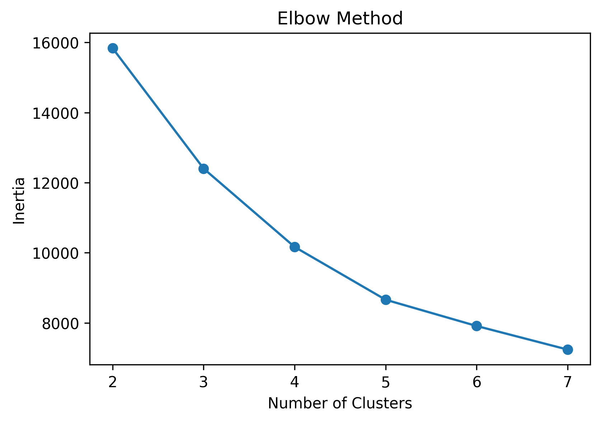
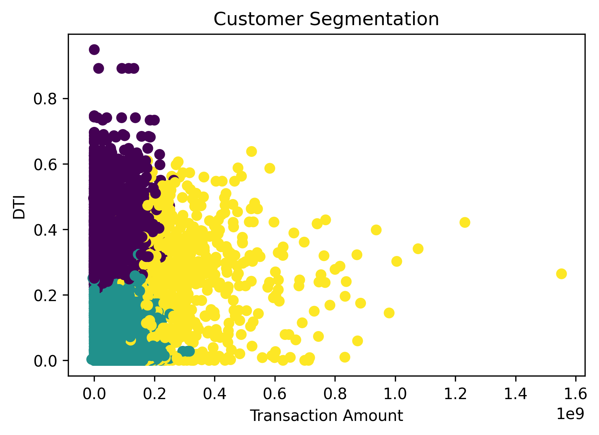
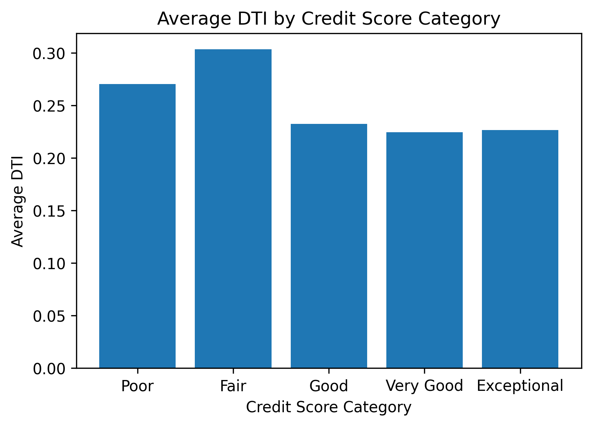

# RevoBank Customer Segmentation Analysis
Customer segmentation analysis using Python and K-Means clustering to identify high-value customers, growth opportunities, and risk segments for targeted marketing and credit risk management.

## SECTION 1: PROJECT SUMMARY FOR PORTFOLIO
### Summary/Context
RevoBank, an Indonesian bank, sought to increase credit card usage among existing customers. The Performance Management team analyzed six months of MIS data, covering 5,599 initial card records and user details. The project focused on evaluating transaction behavior to identify segments, assess financial risks, and drive bank profitability through data-driven insights.
### Goals
The primary objective was to encourage more frequent credit card transactions by existing users. The analysis aimed to clean and prepare accurate data to identify distinct customer segments and financial risks. Ultimately, the project sought to uncover opportunities to increase transaction frequency and enhance RevoBank's overall profitability.
### Process
The process began with rigorous data cleaning, including type conversion, duplicate removal, and handling 12 null credit limit rows. After merging card and user datasets, Exploratory Data Analysis (EDA) assessed fraud rates and DTI ratios. Finally, K-Means clustering was applied using transaction value, activity, credit exposure, and risk indicators.
### Output
Segmentation revealed three distinct groups: Cluster 2 is the primary profit driver with high activity, Cluster 1 shows growth potential with low risk, and Cluster 0 presents higher risk with limited revenue. RevoBank should prioritize Cluster 2 with loyalty programs, target Cluster 1 with spending incentives, and apply conservative credit management to Cluster 0.

## SECTION 2: SCOPE OF WORK / ACHIEVEMENTS (AQS FRAMEWORK)
- Cleaned and standardized 5,599 card records by removing 31 duplicates and filtering expired cards to ensure data integrity.
- Calculated Debt-to-Income (DTI) ratios, finding an average of 0.26, to assess financial burden for 5,528 valid customers.
- Developed a K-Means clustering model with k=3 to segment customers based on transaction behavior, credit exposure, and risk.
- Analyzed transaction distributions showing Mastercard and Visa dominate activity while identifying that over 75% of users had no fraud.

## SECTION 3: TOOLS & METHODS
### A. Tools
- Python 
- Pandas 
- NumPy
- Scikit-learn
- Matplotlib
- Google Colab 
- Google Sheets
  
### B. Methods
- Data Cleaning 
- Data Type Conversion 
- Feature Engineering (Age, Retired Flag, DTI) 
- Exploratory Data Analysis (EDA) 
- K-Means Clustering 
- Elbow Method 
- Descriptive Statistics

## Dataset
This project uses transaction and user data including:
- Customer ID
- Transaction Amount
- Credit Limit
- Debt-to-Income Ratio (DTI)
- Credit Card Brand
- Fraud Indicator
Dataset contains 6 months of transaction records used to analyze customer behavior and credit risk patterns.

### Dataset Source:
https://colab.research.google.com/drive/16W4HMBOCzcr4FQkde9CDAhTRWKzSSQFC

## SECTION 4: VISUAL SUGGESTIONS
- *Pie Chart of Fraud Rate* : A visual representation showing the proportion of fraud transaction value compared to total transaction value.
- *Elbow Method Plot* : A line graph showing the elbow point at k=3 to justify the chosen number of customer segments.
- *Transaction Behavior Bar Chart* : A comparison of transaction amounts across different card brands (Mastercard, Visa, Amex, and JCB).
- *DTI Distribution Plot* : A visual comparison of Debt-to-Income ratios between retired and non-retired users or across credit score categories.
- *Customer Segment Visualization* : A scatter plot or similar visual showing the three clusters formed based on transaction value and risk.

## Key Visualizations
### Elbow Method

### Customer Segmentation

### Average Spending by Cluster

## Key Insights
- Customer segmentation reveals distinct behavioral patterns across transaction activity and spending.
- A small segment of high-value customers contributes a significant portion of transaction volume.
- Medium-value customers represent the largest growth opportunity for targeted marketing campaigns.
- Segmentation enables the bank to design personalized loyalty programs and optimize credit product strategies.

## Business Recommendations
- Develop targeted loyalty programs for high-value customer segments.
- Design promotional campaigns aimed at medium-value customers to increase transaction frequency.
- Offer customized credit card benefits based on customer spending behavior.
- Use segmentation insights to improve cross-selling opportunities for financial products.

## Project Files
This repository contains the following project resources:
- revobank_customer_segmentation.ipynb  
  Python notebook used for data cleaning, clustering, and visualization.
- customer_segmentation_dataset.csv  
  Dataset used for the analysis.
- README.md  
  Project documentation including methodology, analysis, and insights.
  
## Author
Venny Amilia Deslaweny

